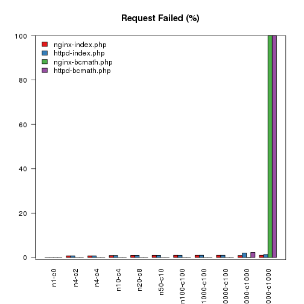
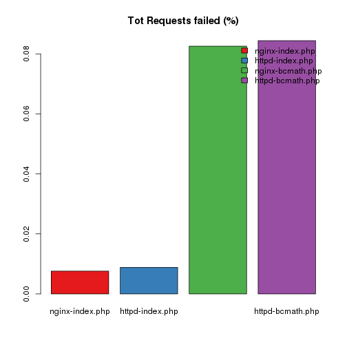
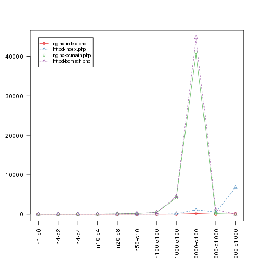
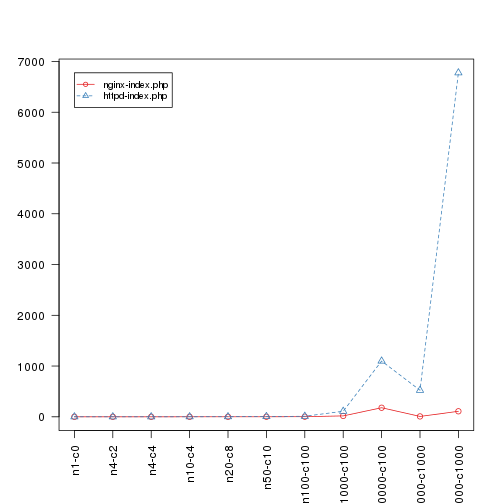
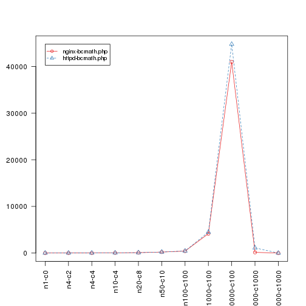

## Apache Httpd Vs Nginx

Using Apache Benchmark utility, `ab`, i will perform a series of request against apache and nginx of the same php page script, using bcmath and doing some computations. The results are stored from redirecting the stdout to some '*.log' files.

### Parsing the logs

To parse and extract data from the logs file i will use some helper function.

I will use a utility function to generate the file name to be read, it is shared between different scripts. So it will be included from an external file:


```r
source("./shared_utils.r")
```

What I have just loaded is this function:

```r
print (generateLogFileName)
```

```
## function (n, c, log, csv = FALSE) 
## {
##     res <- paste("logs/", log, "-n", n, sep = "")
##     if (c > 0) {
##         res <- paste(res, "-c", c, sep = "")
##     }
##     res <- paste(res, ".log", sep = "")
##     if (csv) {
##         res <- paste(res, ".csv", sep = "")
##     }
##     return(res)
## }
```

and this are the `-n` and `-c` parameters used with the `ab` program:

```r
print(tests)
```

```
##         n    c
## 1       1    0
## 2       4    2
## 3       4    4
## 4      10    4
## 5      20    8
## 6      50   10
## 7     100  100
## 8    1000  100
## 9   10000  100
## 10  10000 1000
## 11 100000 1000
```

I use this function to read and parse the data I want directly from the log files, if an error occur during the read operation, it will return an empty equivalent vector of the expected result:


```r
extractDataFromLogTable <- function (logFileNamePrefix, n, c) {
  fn <- generateLogFileName(n, c, logFileNamePrefix)
  #print(fn)
  tryCatch({
  t <- read.table(fn, sep=":", skip=6, comment.char='', fill=T, stringsAsFactors=FALSE, strip.white = TRUE)
  
#1.   webServer <- t$V2[1]
#2.   docLength <- t$V2[5]
#3.   concurrencyLevel <- t$V2[6]
#4.X  totTime <- t$V2[7]
#5.   reqCompleted <- t$V2[8]
#6.X  reqFailed <- t$V2[9]
#7.   writeErrors <- t$V2[10]
#8.   keepAlive <- t$V2[12]  
#9.   reqPerSec <- t$V2[13]
#10.   timePerReq <- t$V2[14]
#11.  timePerReq2 <- t$V2[15]
#12.  transRate <- t$V2[16]
#13.  total <-t$V2[22]
  t$V2[c(1,5:10,12:16,22)]
  }, error = function(err) {
     r <-rep(0,12)
     r[c(1,4)] <- ''
  })
}
```

The choice to do not preload all the data and do the processing after, it is due to having an approch to load only the data required at the time of the computation, (with R is still required to explicitly `rm` variables from the environments(). The file should be cached by OS if memory is available so there is no much such performance lost at least for this case, except reparsing the file each time, but it is a good trade off.

here we are extracting the webservers used:


```r
webServers_ <- c("nginx", "httpd")
webTests <- c("index.php", "bcmath.php")
webServers <- apply(expand.grid(webServers_, webTests), 1, function(x) {paste(x[1],x[2],sep="-")})
webServerNames <- webServers
print(webServerNames)
```

```
## [1] "nginx-index.php"  "httpd-index.php"  "nginx-bcmath.php"
## [4] "httpd-bcmath.php"
```

and here the column names, used also for axis x-labeling:

```r
colNames <- paste(paste('n',tests$n, sep=''), paste('c',tests$c, sep=''), sep='-')
print(colNames)
```

```
##  [1] "n1-c0"         "n4-c2"         "n4-c4"         "n10-c4"       
##  [5] "n20-c8"        "n50-c10"       "n100-c100"     "n1000-c100"   
##  [9] "n10000-c100"   "n10000-c1000"  "n100000-c1000"
```


## plots and data

The first plot is the error of the responses:


```
## [1]   0 100
```



|                 | n1-c0| n4-c2| n4-c4| n10-c4| n20-c8| n50-c10| n100-c100| n1000-c100| n10000-c100| n10000-c1000| n100000-c1000|
|:----------------|-----:|-----:|-----:|------:|------:|-------:|---------:|----------:|-----------:|------------:|-------------:|
|nginx-index.php  |     0|  0.75|  0.75|    0.9|   0.95|    0.98|      0.99|      0.994|      0.9976|       0.9050|       0.99336|
|httpd-index.php  |     0|  0.75|  0.75|    0.9|   0.95|    0.96|      0.98|      0.999|      0.9987|       2.0286|       1.37827|
|nginx-bcmath.php |     0|  0.00|  0.00|    0.0|   0.00|    0.00|      0.00|      0.000|      0.0001|       0.0719|     100.00000|
|httpd-bcmath.php |     0|  0.00|  0.00|    0.0|   0.00|    0.00|      0.00|      0.000|      0.0000|       2.2935|     100.00000|



```
##  nginx-index.php  httpd-index.php nginx-bcmath.php httpd-bcmath.php 
##      0.007599667      0.008824704      0.082575151      0.084408238
```

The second one is total time to complete the requests.

I am using another helper function to extract and parse data:

```r
compareTimeResults <- function (n, c, webServers) {
  timeCmp <- unlist(lapply(webServers, function(x){ 
    tmp <- extractDataFromLogTable(x,n,c)[4]
    ifelse(is.na(tmp), 0, tmp)
  }))
  unlist(lapply(timeCmp, function(x) { as.numeric(strsplit(x, ' ', T)[[1]][1])}))
}
```

here the plot:

```
## [1]     0.00 44763.49
```



|                 |  n1-c0|  n4-c2|  n4-c4| n10-c4| n20-c8| n50-c10| n100-c100| n1000-c100| n10000-c100| n10000-c1000| n100000-c1000|
|:----------------|------:|------:|------:|------:|------:|-------:|---------:|----------:|-----------:|------------:|-------------:|
|nginx-index.php  |  0.036|  0.076|  0.078|  0.183|  0.404|   0.971|     1.961|     17.985|     178.661|        7.395|       108.319|
|httpd-index.php  |  0.193|  0.451|  0.455|  1.087|  2.165|   5.378|    10.740|    109.436|    1098.726|      522.571|      6777.184|
|nginx-bcmath.php |  8.429| 16.907| 16.940| 42.692| 86.063| 214.142|   423.872|   4154.059|   40979.648|      152.602|         0.000|
|httpd-bcmath.php | 13.689| 18.162| 17.981| 44.688| 89.119| 221.703|   445.463|   4479.030|   44763.489|     1115.982|         0.000|

now splitting the plot for the 2 different tests:

```
## [1]    0.000 6777.184
```



|                | n1-c0| n4-c2| n4-c4| n10-c4| n20-c8| n50-c10| n100-c100| n1000-c100| n10000-c100| n10000-c1000| n100000-c1000|
|:---------------|-----:|-----:|-----:|------:|------:|-------:|---------:|----------:|-----------:|------------:|-------------:|
|nginx-index.php | 0.036| 0.076| 0.078|  0.183|  0.404|   0.971|     1.961|     17.985|     178.661|        7.395|       108.319|
|httpd-index.php | 0.193| 0.451| 0.455|  1.087|  2.165|   5.378|    10.740|    109.436|    1098.726|      522.571|      6777.184|

```
## [1]     0.00 44763.49
```



|                 |  n1-c0|  n4-c2|  n4-c4| n10-c4| n20-c8| n50-c10| n100-c100| n1000-c100| n10000-c100| n10000-c1000| n100000-c1000|
|:----------------|------:|------:|------:|------:|------:|-------:|---------:|----------:|-----------:|------------:|-------------:|
|nginx-bcmath.php |  8.429| 16.907| 16.940| 42.692| 86.063| 214.142|   423.872|   4154.059|    40979.65|      152.602|             0|
|httpd-bcmath.php | 13.689| 18.162| 17.981| 44.688| 89.119| 221.703|   445.463|   4479.030|    44763.49|     1115.982|             0|
